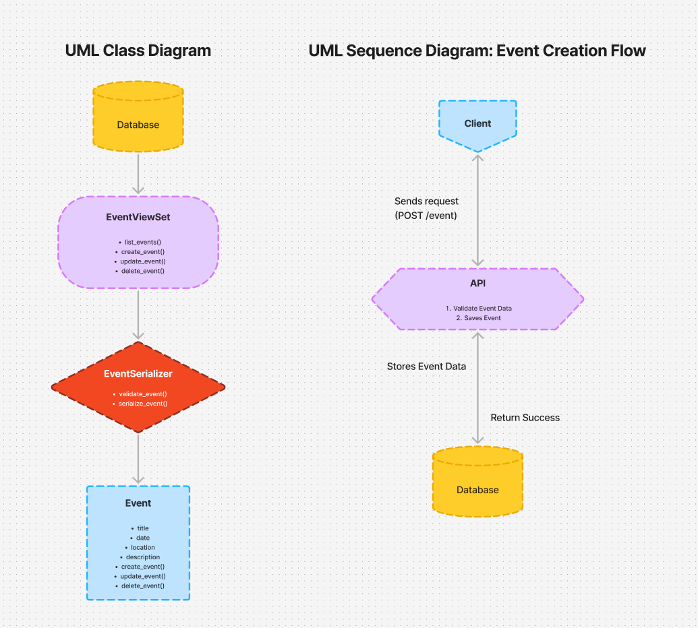

# **Event Management API**

## **Project Overview**

The **Event Management API** is a Django-based web application designed to manage events. It allows users to perform CRUD (Create, Read, Update, Delete) operations on events, with support for filtering and ordering based on event attributes like date and location. The API provides a robust logging mechanism to track user actions and system changes.

---

## **Setup Instructions**

### **1. Clone the Repository**

Clone the repository to your local machine:

```bash
git clone https://github.com/your-repo/event-management-api.git
cd event-management-api
```

### **2. Set Up Virtual Environment**

Create and activate a virtual environment:

```bash
python -m venv venv
source venv/bin/activate  # On Windows, use `venv\Scripts\activate`
```

### **3. Install Dependencies**

Install the necessary dependencies:

```bash
pip install -r requirements.txt
```

### **4. Set Up Database**

Run the migrations to set up the database:

```bash
python manage.py migrate
```

### **5. Create a Superuser**

Create an admin user to access the Django admin interface:

```bash
python manage.py createsuperuser
```

### **6. Run the Development Server**

Start the Django development server:

```bash
python manage.py runserver
```

The application should now be accessible at http://127.0.0.1:8000/.

## **API Documentation**

### **Base URL**

The base URL for the API is:

http://127.0.0.1:8000/api/

### **API Endpoints**

1. **GET /api/events/**

   - **Description**: Retrieve a list of events.
   - **Query Parameters**:
     - `ordering`: Order by date (e.g., `ordering=date`).
     - `date`: Filter events by date.
     - `location`: Filter events by location.
   - **Response**: A list of event objects.

2. **POST /api/events/**

   - **Description**: Create a new event.
   - **Request Body**:
     - `title` (string): The title of the event.
     - `date` (date): The date of the event.
     - `location` (string): The location of the event.
     - `description` (string): Description of the event.
   - **Response**: The created event object.

3. **GET /api/events/{id}/**

   - **Description**: Retrieve a specific event by its ID.
   - **Response**: A single event object.

4. **PUT /api/events/{id}/**

   - **Description**: Update an existing event by its ID.
   - **Request Body**: Same as `POST` request.
   - **Response**: The updated event object.

5. **DELETE /api/events/{id}/**
   - **Description**: Delete an event by its ID.
   - **Response**: A success message indicating the event has been deleted.

## **Testing Instructions**

### **1. Run Tests**

To run the tests, use the following command:

```bash
python manage.py test
```

### **2. Test Coverage**

The tests cover:

- CRUD operations: Ensuring events can be created, retrieved, updated, and deleted properly.
- Filtering and Ordering: Verifying that filtering by date and location works and that events are ordered correctly.
- Logging: Ensuring that event creation, update, and deletion actions are logged.

## **Design Document**

Open ./DesignDocument.md

## **UML Diagram**


